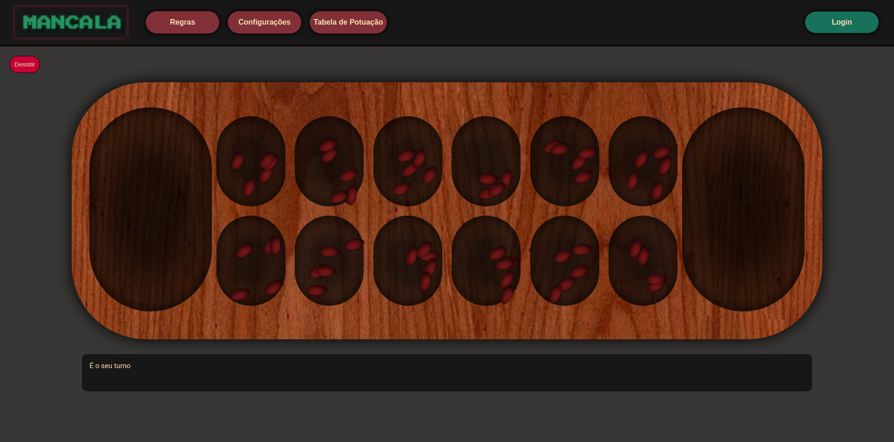

# LTW: MANCALA

# Description
O objetivo deste projeto era desenvolver uma aplicação web que possibilitasse ao utilizador jogar Mancala contra uma AI ou em modo multi jogador. A aplicação web deveria ser single-page e o mutlti-jogador será prestado por um servidor em Node.js.
O website possibilita a vista das intruções, alteração das configurações do jogo, ranking local e remoto, bem como registro neste. Em modo de jogador pode ainda escolher jogar contra AIs de diferentes niveis de dificuldade. 

# Preview

  

# Results
O projeto vai de encontro ao pretendido, sendo possivel realizar todas as ações previstas no ínicio do projeto.

**GRADE:** 18.6

# Authors
Name | UP | Git Username |
-----|----|--------------|
Marcelo Couto | 201906086 | [marhcouto](https://github.com/marhcouto)
Francisco Oliveira | 201907361 | [frpdoliv](https://github.com/frpdoliv)
